# Data Contracts Wireframe for Snowflake Data Cloud

## Executive Summary

Data contracts are **formal agreements** between data producers and consumers that define the structure, quality, semantics, and governance of shared data. In the Snowflake Data Cloud architecture, data contracts serve as the **connective tissue** between domains, enabling a true data mesh while maintaining centralized governance.

This document provides a step-by-step design for creating and managing data contracts, including UI wireframes, workflow diagrams, and implementation patterns.

---

## Table of Contents

1. [Current State: How Teams Manage Data Contracts Today](#1-current-state)
2. [Vision: Contract-First Data Architecture](#2-vision)
3. [Data Contract Taxonomy](#3-taxonomy)
4. [Contract Lifecycle Management](#4-lifecycle)
5. [Schema & Metadata Design](#5-schema-design)
6. [Governance Integration](#6-governance)
7. [UI/UX Wireframes](#7-wireframes)
8. [Implementation Architecture](#8-implementation)
9. [CI/CD Integration](#9-cicd)
10. [Monitoring & Observability](#10-observability)

---

## 1. Current State: How Teams Manage Data Contracts Today {#1-current-state}

### Common Approaches

Most organizations today manage data contracts through a combination of:

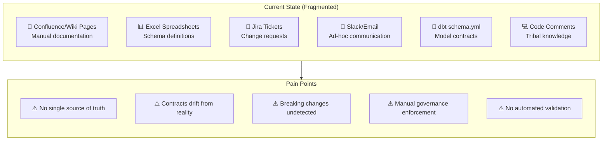

### Current Tooling Landscape

| Approach | Pros | Cons |
|----------|------|------|
| **Wiki/Confluence** | Easy to create, human-readable | Not machine-readable, stale quickly |
| **dbt Contracts** | Integrated with transformations, testable | Only covers transformation layer |
| **Schema Registries** | Machine-readable, versioned | Typically for streaming only (Kafka) |
| **Data Catalogs** | Discovery-focused, metadata-rich | Descriptive, not prescriptive |
| **Custom YAML/JSON** | Flexible, version-controlled | No standardization, manual validation |

### The Gap

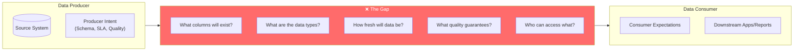

---

## 2. Vision: Contract-First Data Architecture {#2-vision}

### Target State

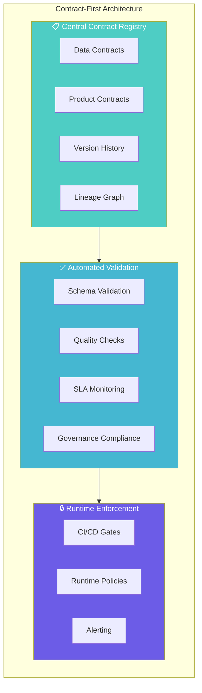

### Core Principles

1. **Contracts as Code**: Version-controlled, machine-readable definitions
2. **Producer Accountability**: Producers own and enforce their contracts
3. **Consumer Protection**: Consumers can rely on contract guarantees
4. **Governance by Default**: Contracts embed classification, residency, AI eligibility
5. **Continuous Validation**: Automated testing in CI/CD and at runtime

---

## 3. Data Contract Taxonomy {#3-taxonomy}

### Contract Types

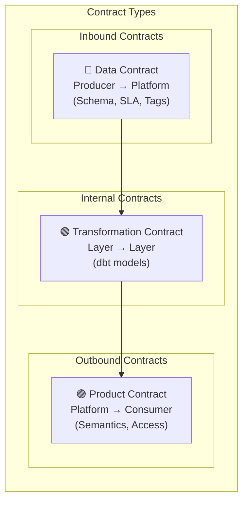

### Contract Hierarchy

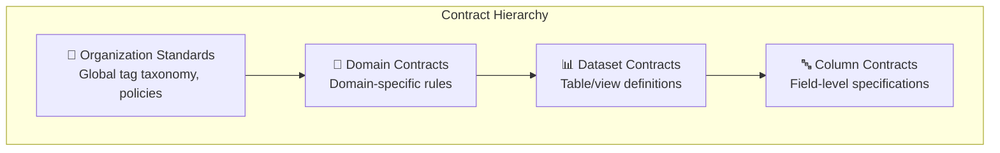

---

## 4. Contract Lifecycle Management {#4-lifecycle}

### Lifecycle Stages

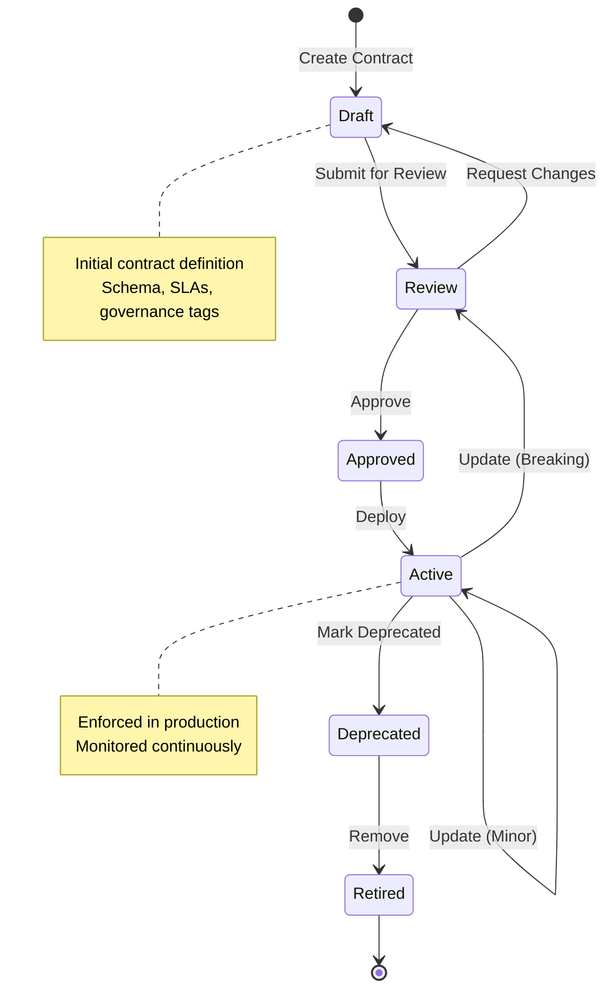

### Version Management

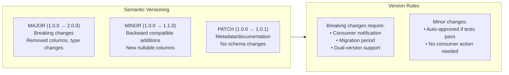

### Change Management Workflow

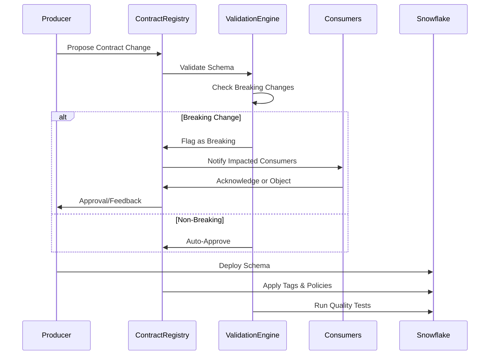

---

## 5. Schema & Metadata Design {#5-schema-design}

### Data Contract Schema (YAML)

```yaml
# contracts/data/crm_customer_v2.yml
contract:
  # ─────────────────────────────────────────────────────────
  # IDENTITY & OWNERSHIP
  # ─────────────────────────────────────────────────────────
  id: crm_customer_v2
  version: 2.1.0
  status: active  # draft | review | approved | active | deprecated | retired
  
  producer:
    system: EXTERNAL_CRM
    team: Customer Data Platform
    owner: cdp-team@company.com
    slack_channel: "#cdp-data-contracts"
  
  # ─────────────────────────────────────────────────────────
  # SCHEMA DEFINITION
  # ─────────────────────────────────────────────────────────
  schema:
    database: RAW_${REGION}
    schema: RAW_CRM
    table: CUSTOMER_RAW
    
    columns:
      - name: CUSTOMER_ID
        type: VARCHAR(64)
        description: "Unique customer identifier from CRM"
        constraints:
          - not_null
          - unique
        tests:
          - type: regex
            pattern: "^CUST-[A-Z0-9]{8}$"
        tags:
          DATA_CLASSIFICATION: INTERNAL
          PII_TYPE: NONE
          AI_ALLOWED: TRUE
          
      - name: EMAIL
        type: VARCHAR(256)
        description: "Customer primary email address"
        constraints:
          - not_null
        tests:
          - type: regex
            pattern: "^[a-zA-Z0-9._%+-]+@[a-zA-Z0-9.-]+\\.[a-zA-Z]{2,}$"
        tags:
          DATA_CLASSIFICATION: CONFIDENTIAL
          PII_TYPE: MODERATE
          AI_ALLOWED: PSEUDONYMIZED_ONLY
          RESIDENCY_REGION: ORIGIN
          
      - name: PHONE_NUMBER
        type: VARCHAR(32)
        description: "Customer phone number"
        constraints: []
        tests: []
        tags:
          DATA_CLASSIFICATION: CONFIDENTIAL
          PII_TYPE: LOW
          AI_ALLOWED: FALSE
          
      - name: CREATED_AT
        type: TIMESTAMP_NTZ
        description: "Record creation timestamp in source"
        constraints:
          - not_null
        tags:
          DATA_CLASSIFICATION: INTERNAL
          PII_TYPE: NONE
          AI_ALLOWED: TRUE
          
      - name: _LOADED_AT
        type: TIMESTAMP_NTZ
        description: "Snowflake ingestion timestamp"
        constraints:
          - not_null
        system_managed: true
        
      - name: _SOURCE_FILE
        type: VARCHAR(1024)
        description: "Source file or batch identifier"
        system_managed: true

  # ─────────────────────────────────────────────────────────
  # SERVICE LEVEL AGREEMENTS
  # ─────────────────────────────────────────────────────────
  sla:
    freshness:
      max_age_minutes: 60
      measurement: "MAX(_LOADED_AT) vs CURRENT_TIMESTAMP()"
      
    completeness:
      threshold_percent: 99.5
      critical_columns:
        - CUSTOMER_ID
        - EMAIL
        
    availability:
      uptime_percent: 99.9
      maintenance_window: "Sunday 02:00-04:00 UTC"
      
    volume:
      expected_daily_rows:
        min: 10000
        max: 500000
      alert_on_variance_percent: 25

  # ─────────────────────────────────────────────────────────
  # QUALITY RULES
  # ─────────────────────────────────────────────────────────
  quality_rules:
    - id: qr_001
      name: valid_email_format
      type: column_check
      column: EMAIL
      sql: "EMAIL REGEXP '^[a-zA-Z0-9._%+-]+@[a-zA-Z0-9.-]+\\.[a-zA-Z]{2,}$'"
      severity: error
      
    - id: qr_002
      name: no_duplicate_customers
      type: table_check
      sql: "COUNT(*) = COUNT(DISTINCT CUSTOMER_ID)"
      severity: error
      
    - id: qr_003
      name: created_not_future
      type: column_check
      column: CREATED_AT
      sql: "CREATED_AT <= CURRENT_TIMESTAMP()"
      severity: warning

  # ─────────────────────────────────────────────────────────
  # GOVERNANCE & COMPLIANCE
  # ─────────────────────────────────────────────────────────
  governance:
    classification: CONFIDENTIAL
    residency_requirements:
      - EU data must remain in EU regions
      - PII cannot leave origin region without pseudonymization
    retention_days: 2555  # 7 years
    ai_eligibility: PSEUDONYMIZED_ONLY
    
  # ─────────────────────────────────────────────────────────
  # LINEAGE & DEPENDENCIES
  # ─────────────────────────────────────────────────────────
  lineage:
    source_systems:
      - name: External CRM
        connection: CRM_API
        extraction: CDC
        
    downstream_dependencies:
      - contract_id: curated_customer_entity_v1
        type: transformation
      - contract_id: sem_customer_analytics_v1
        type: product

  # ─────────────────────────────────────────────────────────
  # CONSUMERS & ACCESS
  # ─────────────────────────────────────────────────────────
  consumers:
    - team: Analytics
      contact: analytics@company.com
      use_case: Customer segmentation
      access_level: read_masked
      
    - team: Marketing
      contact: marketing-data@company.com  
      use_case: Campaign targeting
      access_level: read_masked
```

### Product Contract Schema (YAML)

```yaml
# contracts/products/customer_analytics_v1.yml
product:
  # ─────────────────────────────────────────────────────────
  # IDENTITY & OWNERSHIP
  # ─────────────────────────────────────────────────────────
  id: sem_customer_analytics_v1
  version: 1.0.0
  status: active
  
  owner:
    team: Customer Analytics Platform
    contact: cap-team@company.com
    
  description: |
    Policy-aware customer analytics semantic view for BI tools and APIs.
    Provides pre-aggregated, privacy-safe customer metrics and segments.
    
  # ─────────────────────────────────────────────────────────
  # OUTPUT SPECIFICATION
  # ─────────────────────────────────────────────────────────
  output:
    type: secure_view
    database: SEM_${REGION}
    schema: SEM_ANALYTICS
    object: VW_CUSTOMER_ANALYTICS
    
    columns:
      - name: CUSTOMER_SEGMENT
        type: VARCHAR
        description: "Anonymized customer segment classification"
        
      - name: REGION
        type: VARCHAR
        description: "Geographic region"
        
      - name: TOTAL_CUSTOMERS
        type: NUMBER
        description: "Count of customers in segment"
        
      - name: AVG_LIFETIME_VALUE
        type: FLOAT
        description: "Average customer lifetime value"
        
      - name: AS_OF_DATE
        type: DATE
        description: "Data freshness date"

  # ─────────────────────────────────────────────────────────
  # LINEAGE
  # ─────────────────────────────────────────────────────────
  lineage:
    sources:
      - contract_id: curated_customer_entity_v1
        layer: CURATED
      - contract_id: crm_customer_v2
        layer: RAW
        
    transformations:
      - dbt_model: int_customer_metrics
      - dbt_model: fct_customer_segments
      - dbt_model: vw_customer_analytics

  # ─────────────────────────────────────────────────────────
  # GUARANTEES
  # ─────────────────────────────────────────────────────────
  guarantees:
    freshness:
      max_age_hours: 24
      refresh_schedule: "0 6 * * *"  # 6 AM daily
      
    quality:
      completeness_percent: 99.9
      
    availability:
      uptime_sla: 99.95%

  # ─────────────────────────────────────────────────────────
  # ACCESS CONTROL
  # ─────────────────────────────────────────────────────────
  access:
    visibility: internal_marketplace
    
    allowed_roles:
      - DATA_ANALYST_${REGION}
      - BI_DEVELOPER_${REGION}
      - DATA_SCIENTIST_${REGION}
      
    restricted_roles:
      - EXTERNAL_PARTNER
      
    residency: region_only

  # ─────────────────────────────────────────────────────────
  # AI CONSTRAINTS
  # ─────────────────────────────────────────────────────────
  ai_constraints:
    embedding_allowed: true
    raw_pii_in_output: false
    vector_table: VEC_CUSTOMER_SEGMENTS
    model_training_allowed: true
```

### Tag Taxonomy Reference

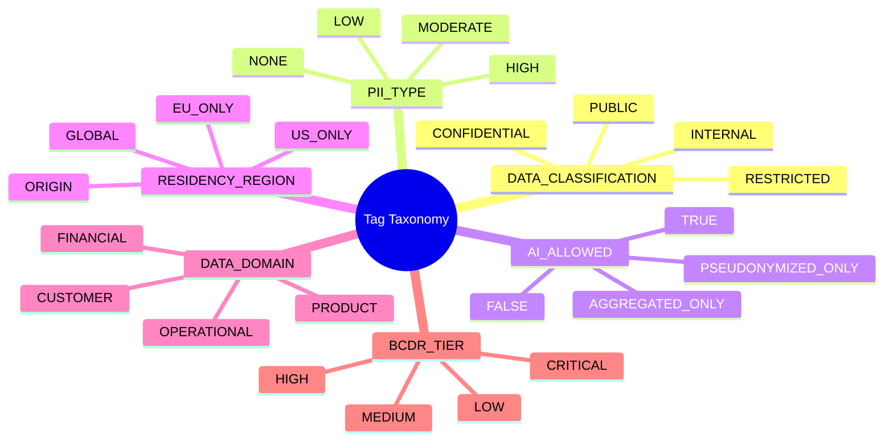

---

## 6. Governance Integration {#6-governance}

### Tag Application Flow

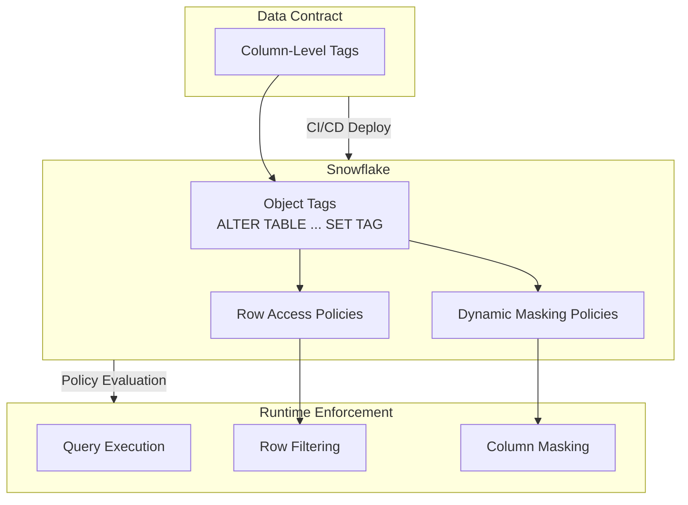

### Contract-to-Policy Mapping

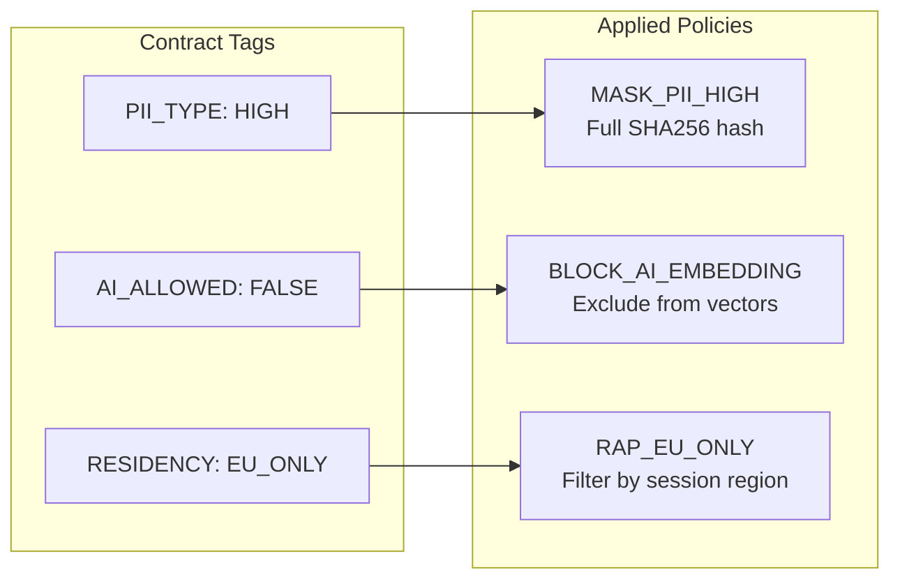

### Governance Dashboard Data Model

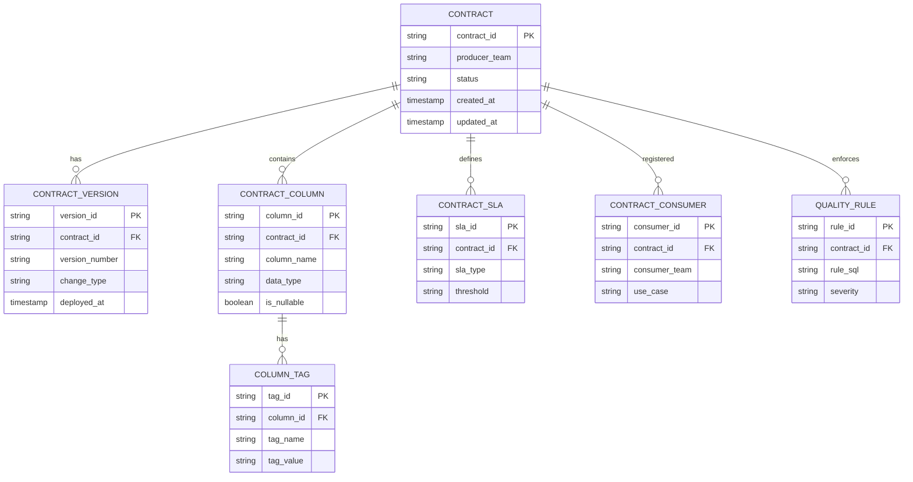

---

## 7. UI/UX Wireframes {#7-wireframes}

### 7.1 Contract Registry Dashboard

```
┌─────────────────────────────────────────────────────────────────────────────────┐
│  🏠 Data Contracts Hub                                      [+ New Contract] 🔍 │
├─────────────────────────────────────────────────────────────────────────────────┤
│                                                                                 │
│  📊 Overview                                                                    │
│  ┌─────────────┐  ┌─────────────┐  ┌─────────────┐  ┌─────────────┐            │
│  │     47      │  │     12      │  │      3      │  │     89%     │            │
│  │   Active    │  │   Review    │  │  Breaking   │  │ Compliance  │            │
│  │  Contracts  │  │   Pending   │  │   Changes   │  │    Score    │            │
│  └─────────────┘  └─────────────┘  └─────────────┘  └─────────────┘            │
│                                                                                 │
│  ─────────────────────────────────────────────────────────────────────────────  │
│                                                                                 │
│  📋 Recent Contracts                                    [Data ▾] [Product ▾]    │
│  ┌─────────────────────────────────────────────────────────────────────────┐   │
│  │ Contract ID          │ Owner    │ Status  │ Version │ Updated    │ ⚙️  │   │
│  ├─────────────────────────────────────────────────────────────────────────┤   │
│  │ 🔵 crm_customer_v2   │ CDP Team │ ✅ Active │ 2.1.0  │ 2 hrs ago │ ⋮   │   │
│  │ 🔵 orders_raw_v1     │ Commerce │ ✅ Active │ 1.5.0  │ 1 day ago │ ⋮   │   │
│  │ 🟣 sem_analytics_v1  │ Analytics│ ✅ Active │ 1.0.0  │ 3 days    │ ⋮   │   │
│  │ 🔵 inventory_v2      │ Supply   │ 🔄 Review │ 2.0.0  │ 4 hrs ago │ ⋮   │   │
│  │ 🔵 payments_raw_v1   │ Finance  │ ⚠️ Breaking│ 2.0.0  │ 1 hr ago  │ ⋮   │   │
│  └─────────────────────────────────────────────────────────────────────────┘   │
│                                                                                 │
│  🔔 Alerts                                                                      │
│  ┌─────────────────────────────────────────────────────────────────────────┐   │
│  │ ⚠️  payments_raw_v1 breaking change requires 3 consumer acknowledgments │   │
│  │ ⚠️  crm_customer_v2 freshness SLA at 95% (threshold: 60 min)            │   │
│  │ ✅  orders_raw_v1 quality checks passed (12/12)                          │   │
│  └─────────────────────────────────────────────────────────────────────────┘   │
│                                                                                 │
└─────────────────────────────────────────────────────────────────────────────────┘
```

### 7.2 Contract Detail View

```
┌─────────────────────────────────────────────────────────────────────────────────┐
│  ← Back    crm_customer_v2                           [Edit] [Deprecate] [Clone] │
├─────────────────────────────────────────────────────────────────────────────────┤
│                                                                                 │
│  ┌──────────────────────────────────────────────────────────────────────────┐  │
│  │  Status: ✅ Active    Version: 2.1.0    Last Updated: Jan 18, 2026       │  │
│  │  Owner: CDP Team (cdp-team@company.com)    Slack: #cdp-data-contracts    │  │
│  └──────────────────────────────────────────────────────────────────────────┘  │
│                                                                                 │
│  ┌────────┬───────────┬──────────┬───────────┬──────────┬─────────────────┐    │
│  │ Schema │ SLAs      │ Quality  │ Consumers │ Lineage  │ Version History │    │
│  └────────┴───────────┴──────────┴───────────┴──────────┴─────────────────┘    │
│                                                                                 │
│  📐 Schema Definition                                                           │
│  Target: RAW_${REGION}.RAW_CRM.CUSTOMER_RAW                                     │
│                                                                                 │
│  ┌───────────────────────────────────────────────────────────────────────────┐ │
│  │ Column         │ Type          │ Nullable │ Tags                          │ │
│  ├───────────────────────────────────────────────────────────────────────────┤ │
│  │ CUSTOMER_ID    │ VARCHAR(64)   │ ❌       │ 🏷️ INTERNAL, 🤖 AI:TRUE       │ │
│  │ EMAIL          │ VARCHAR(256)  │ ❌       │ 🔒 CONFIDENTIAL, 🤖 AI:PSEUDO │ │
│  │ PHONE_NUMBER   │ VARCHAR(32)   │ ✅       │ 🔒 CONFIDENTIAL, 🤖 AI:FALSE  │ │
│  │ CREATED_AT     │ TIMESTAMP_NTZ │ ❌       │ 🏷️ INTERNAL, 🤖 AI:TRUE       │ │
│  │ _LOADED_AT     │ TIMESTAMP_NTZ │ ❌       │ 🔧 System                      │ │
│  │ _SOURCE_FILE   │ VARCHAR(1024) │ ✅       │ 🔧 System                      │ │
│  └───────────────────────────────────────────────────────────────────────────┘ │
│                                                                                 │
│  🔍 Column Detail: EMAIL                                                        │
│  ┌───────────────────────────────────────────────────────────────────────────┐ │
│  │  Description: Customer primary email address                              │ │
│  │                                                                           │ │
│  │  Constraints:           Tests:                   Tags:                    │ │
│  │  ☑️ NOT NULL            ✅ Regex validation      DATA_CLASSIFICATION:     │ │
│  │                         Pattern: email regex     CONFIDENTIAL             │ │
│  │                                                                           │ │
│  │  Applied Policies:                               PII_TYPE: MODERATE       │ │
│  │  🔐 MASK_PII_MODERATE (SHA256 partial mask)      AI_ALLOWED: PSEUDO_ONLY  │ │
│  │  🌍 RAP_RESIDENCY_ORIGIN                         RESIDENCY: ORIGIN        │ │
│  └───────────────────────────────────────────────────────────────────────────┘ │
│                                                                                 │
└─────────────────────────────────────────────────────────────────────────────────┘
```

### 7.3 Contract Creation Wizard

```
┌─────────────────────────────────────────────────────────────────────────────────┐
│  Create New Data Contract                                        Step 2 of 5   │
├─────────────────────────────────────────────────────────────────────────────────┤
│                                                                                 │
│  ○─────○─────●─────○─────○                                                      │
│  Basics  Schema  Tags   SLAs  Review                                            │
│                                                                                 │
│  ─────────────────────────────────────────────────────────────────────────────  │
│                                                                                 │
│  📐 Define Schema                                                               │
│                                                                                 │
│  Import From:  [Snowflake Table ▾]  [Select Object...]                          │
│                                                                                 │
│  ─────────────────────────────────────────────────────────────────────────────  │
│                                                                                 │
│  ┌───────────────────────────────────────────────────────────────────────────┐ │
│  │ Column Name      │ Type          │ Nullable │ Constraints   │ [+ Add]    │ │
│  ├───────────────────────────────────────────────────────────────────────────┤ │
│  │ [CUSTOMER_ID   ] │ [VARCHAR(64)] │ [ ]      │ [+ Add]       │ 🗑️         │ │
│  │ [EMAIL         ] │ [VARCHAR    ] │ [ ]      │ UNIQUE        │ 🗑️         │ │
│  │ [CREATED_AT    ] │ [TIMESTAMP  ] │ [ ]      │               │ 🗑️         │ │
│  └───────────────────────────────────────────────────────────────────────────┘ │
│                                                                                 │
│  [+ Add Column]                                                                 │
│                                                                                 │
│  ─────────────────────────────────────────────────────────────────────────────  │
│                                                                                 │
│  💡 Tip: Import from existing Snowflake table to auto-populate schema          │
│                                                                                 │
│                                                    [← Back]  [Next: Tags →]    │
│                                                                                 │
└─────────────────────────────────────────────────────────────────────────────────┘
```

### 7.4 Tag Assignment Interface

```
┌─────────────────────────────────────────────────────────────────────────────────┐
│  Create New Data Contract                                        Step 3 of 5   │
├─────────────────────────────────────────────────────────────────────────────────┤
│                                                                                 │
│  ○─────○─────●─────○─────○                                                      │
│  Basics  Schema  Tags   SLAs  Review                                            │
│                                                                                 │
│  ─────────────────────────────────────────────────────────────────────────────  │
│                                                                                 │
│  🏷️ Governance Tags                                                             │
│                                                                                 │
│  Table-Level Tags:                                                              │
│  ┌───────────────────────────────────────────────────────────────────────────┐ │
│  │  DATA_DOMAIN:    [CUSTOMER        ▾]                                      │ │
│  │  BCDR_TIER:      [HIGH            ▾]                                      │ │
│  └───────────────────────────────────────────────────────────────────────────┘ │
│                                                                                 │
│  Column-Level Tags:                                                             │
│  ┌───────────────────────────────────────────────────────────────────────────┐ │
│  │ Column       │ Classification │ PII Type  │ AI Allowed     │ Residency   │ │
│  ├───────────────────────────────────────────────────────────────────────────┤ │
│  │ CUSTOMER_ID  │ [INTERNAL   ▾] │ [NONE  ▾] │ [TRUE       ▾] │ [GLOBAL  ▾] │ │
│  │ EMAIL        │ [CONFIDENTIAL] │ [MODERATE]│ [PSEUDO_ONLY▾] │ [ORIGIN  ▾] │ │
│  │ PHONE        │ [CONFIDENTIAL] │ [LOW   ▾] │ [FALSE      ▾] │ [ORIGIN  ▾] │ │
│  │ CREATED_AT   │ [INTERNAL   ▾] │ [NONE  ▾] │ [TRUE       ▾] │ [GLOBAL  ▾] │ │
│  └───────────────────────────────────────────────────────────────────────────┘ │
│                                                                                 │
│  ⚠️ Validation:                                                                 │
│  ┌───────────────────────────────────────────────────────────────────────────┐ │
│  │ ✅ All columns have DATA_CLASSIFICATION                                   │ │
│  │ ✅ All columns have PII_TYPE                                              │ │
│  │ ✅ All columns have AI_ALLOWED                                            │ │
│  │ ⚠️ EMAIL marked CONFIDENTIAL - masking policy will be auto-applied        │ │
│  └───────────────────────────────────────────────────────────────────────────┘ │
│                                                                                 │
│                                                   [← Back]  [Next: SLAs →]     │
│                                                                                 │
└─────────────────────────────────────────────────────────────────────────────────┘
```

### 7.5 Consumer Registration Interface

```
┌─────────────────────────────────────────────────────────────────────────────────┐
│  Register as Consumer: crm_customer_v2                                          │
├─────────────────────────────────────────────────────────────────────────────────┤
│                                                                                 │
│  You are registering your team as a consumer of this data contract.             │
│  This helps producers understand downstream dependencies.                       │
│                                                                                 │
│  ─────────────────────────────────────────────────────────────────────────────  │
│                                                                                 │
│  👥 Consumer Details                                                            │
│  ┌───────────────────────────────────────────────────────────────────────────┐ │
│  │  Team Name:          [Analytics Platform          ]                       │ │
│  │  Contact Email:      [analytics@company.com       ]                       │ │
│  │  Slack Channel:      [#analytics-data             ]                       │ │
│  └───────────────────────────────────────────────────────────────────────────┘ │
│                                                                                 │
│  📝 Use Case                                                                    │
│  ┌───────────────────────────────────────────────────────────────────────────┐ │
│  │  Primary Use Case:   [Customer Segmentation      ▾]                       │ │
│  │  Description:        [Building customer segments for marketing campaigns │ │
│  │                       and predictive analytics models.                  ] │ │
│  └───────────────────────────────────────────────────────────────────────────┘ │
│                                                                                 │
│  🔐 Access Requirements                                                         │
│  ┌───────────────────────────────────────────────────────────────────────────┐ │
│  │  Access Level:       ○ Read (Masked PII)                                  │ │
│  │                      ○ Read (Full - requires approval)                    │ │
│  │                                                                           │ │
│  │  Required Columns:   ☑️ CUSTOMER_ID                                       │ │
│  │                      ☑️ EMAIL (will be masked)                            │ │
│  │                      ☐ PHONE_NUMBER                                       │ │
│  │                      ☑️ CREATED_AT                                        │ │
│  └───────────────────────────────────────────────────────────────────────────┘ │
│                                                                                 │
│  ⚠️ Breaking Change Notifications                                              │
│  ┌───────────────────────────────────────────────────────────────────────────┐ │
│  │  ☑️ Notify me of all breaking changes (removed columns, type changes)     │ │
│  │  ☑️ Notify me of deprecation warnings                                     │ │
│  │  ☐ Notify me of minor changes (new columns)                               │ │
│  └───────────────────────────────────────────────────────────────────────────┘ │
│                                                                                 │
│                                                         [Cancel] [Register →]  │
│                                                                                 │
└─────────────────────────────────────────────────────────────────────────────────┘
```

### 7.6 Breaking Change Workflow

```
┌─────────────────────────────────────────────────────────────────────────────────┐
│  ⚠️ Breaking Change Detected: payments_raw_v1                                   │
├─────────────────────────────────────────────────────────────────────────────────┤
│                                                                                 │
│  Proposed Version: 1.0.0 → 2.0.0                                                │
│  Submitted by: Finance Data Team                                                │
│  Submitted: Jan 18, 2026 at 14:32 UTC                                           │
│                                                                                 │
│  ─────────────────────────────────────────────────────────────────────────────  │
│                                                                                 │
│  📋 Change Summary                                                              │
│  ┌───────────────────────────────────────────────────────────────────────────┐ │
│  │  BREAKING CHANGES:                                                        │ │
│  │  ❌ REMOVED: LEGACY_PAYMENT_ID column                                     │ │
│  │  ⚠️ TYPE CHANGE: AMOUNT from NUMBER(10,2) → NUMBER(15,4)                  │ │
│  │                                                                           │ │
│  │  NON-BREAKING:                                                            │ │
│  │  ✅ ADDED: PAYMENT_METHOD_V2 column (nullable)                            │ │
│  │  ✅ ADDED: PROCESSOR_REFERENCE column (nullable)                          │ │
│  └───────────────────────────────────────────────────────────────────────────┘ │
│                                                                                 │
│  👥 Impacted Consumers (3)                                                      │
│  ┌───────────────────────────────────────────────────────────────────────────┐ │
│  │  Team           │ Use Case              │ Impact     │ Status             │ │
│  ├───────────────────────────────────────────────────────────────────────────┤ │
│  │  Risk Analytics │ Fraud Detection       │ HIGH       │ ⏳ Pending         │ │
│  │  Accounting     │ Financial Reports     │ MEDIUM     │ ✅ Acknowledged    │ │
│  │  Data Science   │ Payment Prediction    │ HIGH       │ ⏳ Pending         │ │
│  └───────────────────────────────────────────────────────────────────────────┘ │
│                                                                                 │
│  📅 Migration Timeline                                                          │
│  ┌───────────────────────────────────────────────────────────────────────────┐ │
│  │  ●────────────────●────────────────●────────────────●                     │ │
│  │  Jan 18          Feb 1            Feb 15           Mar 1                  │ │
│  │  Proposed        v2 Available     v1 Deprecated    v1 Retired             │ │
│  │                  (dual support)                                           │ │
│  └───────────────────────────────────────────────────────────────────────────┘ │
│                                                                                 │
│  As a registered consumer, please acknowledge or object:                        │
│                                                                                 │
│                       [Object with Comment]  [Acknowledge & Accept]            │
│                                                                                 │
└─────────────────────────────────────────────────────────────────────────────────┘
```

### 7.7 Lineage Visualization

```
┌─────────────────────────────────────────────────────────────────────────────────┐
│  🔗 Data Lineage: crm_customer_v2                          [Expand All] [Export]│
├─────────────────────────────────────────────────────────────────────────────────┤
│                                                                                 │
│  Upstream                     Contract                    Downstream            │
│                                                                                 │
│  ┌─────────────────┐                                                            │
│  │ 📦 External     │                                                            │
│  │    CRM API      │─────┐                                                      │
│  │                 │     │                                                      │
│  └─────────────────┘     │         ┌─────────────────┐                          │
│                          │         │                 │      ┌─────────────────┐ │
│  ┌─────────────────┐     ├────────▶│ 🔵 crm_customer │─────▶│ 🟢 curated_     │ │
│  │ 📦 Marketing    │     │         │      _v2        │      │  customer_entity│ │
│  │    Platform     │─────┘         │                 │      │      _v1        │ │
│  │                 │               │   RAW Layer     │      └────────┬────────┘ │
│  └─────────────────┘               └─────────────────┘               │          │
│                                                                      │          │
│                                                                      ▼          │
│                                                        ┌─────────────────┐      │
│                                                        │ 🟣 sem_customer │      │
│                                                        │  _analytics_v1  │      │
│                                                        │                 │      │
│                                                        │   SEM Layer     │      │
│                                                        └────────┬────────┘      │
│                                                                 │               │
│                                                    ┌────────────┼────────────┐  │
│                                                    ▼            ▼            ▼  │
│                                              ┌──────────┐ ┌──────────┐ ┌──────┐ │
│                                              │ Tableau  │ │ Looker   │ │ API  │ │
│                                              │ Dashboard│ │ Reports  │ │Clients││
│                                              └──────────┘ └──────────┘ └──────┘ │
│                                                                                 │
│  Legend:                                                                        │
│  🔵 Data Contract (RAW)  🟢 Transformation Contract  🟣 Product Contract        │
│                                                                                 │
└─────────────────────────────────────────────────────────────────────────────────┘
```

---

## 8. Implementation Architecture {#8-implementation}

### System Architecture

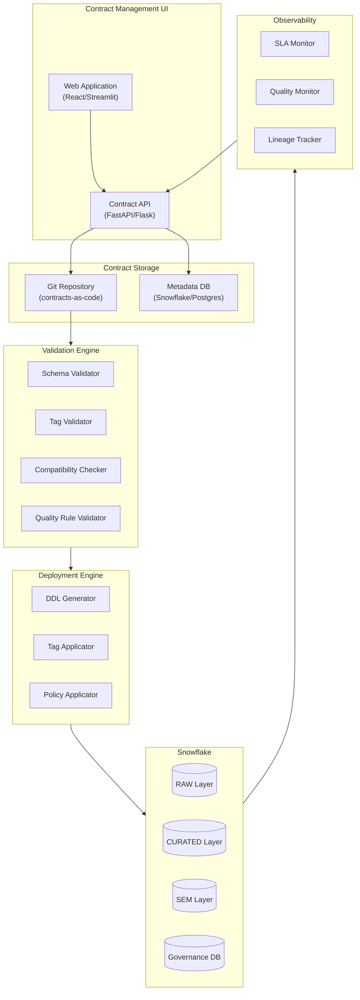

### Streamlit in Snowflake Application

The demo includes a production-ready **Streamlit in Snowflake** application that combines all capabilities:

```
┌─────────────────────────────────────────────────────────────────────────────┐
│                  ❄️ STREAMLIT IN SNOWFLAKE APPLICATION                      │
├─────────────────────────────────────────────────────────────────────────────┤
│                                                                             │
│  SIDEBAR                   MAIN CONTENT AREA                                │
│  ┌──────────┐             ┌─────────────────────────────────────────────┐   │
│  │ ❄️ Logo  │             │                                             │   │
│  │          │             │  🤖 CORTEX ANALYST                          │   │
│  │ Quick    │             │  ┌─────────────────────────────────────┐    │   │
│  │ Stats    │             │  │ Select Semantic Model: [▼ sales]    │    │   │
│  │ ┌──────┐ │             │  └─────────────────────────────────────┘    │   │
│  │ │ 5   │ │             │                                             │   │
│  │ │Ctrct │ │             │  💬 Chat History                           │   │
│  │ └──────┘ │             │  ┌─────────────────────────────────────┐    │   │
│  │ ┌──────┐ │             │  │ You: What was revenue last quarter? │    │   │
│  │ │ 95% │ │             │  │                                     │    │   │
│  │ │Health│ │             │  │ 🤖: Query executed:                 │    │   │
│  │ └──────┘ │             │  │     SELECT SUM(revenue)...          │    │   │
│  │          │             │  │                                     │    │   │
│  │ ─────────│             │  │     [Results Table: $1.2M]          │    │   │
│  │          │             │  └─────────────────────────────────────┘    │   │
│  │ 🤖 Cortex│             │                                             │   │
│  │ 🔮 Horiz │             │  [Ask a question about your data...]       │   │
│  │ 📊 Detail│             │                                             │   │
│  │ ℹ️ About │             └─────────────────────────────────────────────┘   │
│  │          │                                                               │
│  └──────────┘             ┌─────────────────────────────────────────────┐   │
│                           │  🔮 HORIZON DASHBOARD                       │   │
│                           │                                             │   │
│                           │  🚦 SYSTEM HEALTH                           │   │
│                           │  ┌──────┐ ┌──────┐ ┌──────┐ ┌──────┐        │   │
│                           │  │ 🟢   │ │ 🟢   │ │ 🟡   │ │ 🟢   │        │   │
│                           │  │ 95%  │ │ 98%  │ │ 87%  │ │  0   │        │   │
│                           │  │Health│ │ SLA  │ │Quality│ │Alerts│        │   │
│                           │  └──────┘ └──────┘ └──────┘ └──────┘        │   │
│                           │                                             │   │
│                           │  📈 SLA Trend    🏷️ Tag Coverage            │   │
│                           │  ┌───────────┐   ┌───────────┐              │   │
│                           │  │  ╱╲__╱╲   │   │ ████ 100% │              │   │
│                           │  │ ╱      ╲  │   │ ███  85%  │              │   │
│                           │  │╱        ╲ │   │ ██   70%  │              │   │
│                           │  └───────────┘   └───────────┘              │   │
│                           │                                             │   │
│                           │  📋 Contract Health Table                   │   │
│                           │  ┌─────────────────────────────────────┐    │   │
│                           │  │ Status │ Contract │ Health │ SLA    │    │   │
│                           │  │   🟢   │ tpch_v1  │  95%   │  OK    │    │   │
│                           │  │   🟡   │ crm_v1   │  78%   │ WARN   │    │   │
│                           │  └─────────────────────────────────────┘    │   │
│                           └─────────────────────────────────────────────┘   │
│                                                                             │
└─────────────────────────────────────────────────────────────────────────────┘
```

**Deployment**: `sql/12_streamlit_app.sql` creates the app; upload `streamlit/data_contracts_app.py` to the stage.

### Contract Registry Database Schema

```sql
-- Contract Registry Schema in Snowflake
CREATE SCHEMA IF NOT EXISTS GOVERNANCE.CONTRACT_REGISTRY;

-- Core contract table
CREATE TABLE GOVERNANCE.CONTRACT_REGISTRY.CONTRACTS (
    CONTRACT_ID VARCHAR(128) PRIMARY KEY,
    CONTRACT_TYPE VARCHAR(20) NOT NULL, -- 'data' or 'product'
    VERSION VARCHAR(20) NOT NULL,
    STATUS VARCHAR(20) NOT NULL DEFAULT 'draft',
    PRODUCER_TEAM VARCHAR(256),
    PRODUCER_EMAIL VARCHAR(256),
    DESCRIPTION TEXT,
    YAML_DEFINITION VARIANT,
    CREATED_AT TIMESTAMP_NTZ DEFAULT CURRENT_TIMESTAMP(),
    UPDATED_AT TIMESTAMP_NTZ DEFAULT CURRENT_TIMESTAMP(),
    CREATED_BY VARCHAR(256),
    UPDATED_BY VARCHAR(256)
);

-- Contract versions for history
CREATE TABLE GOVERNANCE.CONTRACT_REGISTRY.CONTRACT_VERSIONS (
    VERSION_ID VARCHAR(64) PRIMARY KEY,
    CONTRACT_ID VARCHAR(128) REFERENCES CONTRACTS(CONTRACT_ID),
    VERSION VARCHAR(20),
    CHANGE_TYPE VARCHAR(20), -- 'major', 'minor', 'patch'
    CHANGE_DESCRIPTION TEXT,
    YAML_DEFINITION VARIANT,
    DEPLOYED_AT TIMESTAMP_NTZ,
    DEPLOYED_BY VARCHAR(256),
    CREATED_AT TIMESTAMP_NTZ DEFAULT CURRENT_TIMESTAMP()
);

-- Consumer registrations
CREATE TABLE GOVERNANCE.CONTRACT_REGISTRY.CONTRACT_CONSUMERS (
    CONSUMER_ID VARCHAR(64) PRIMARY KEY,
    CONTRACT_ID VARCHAR(128) REFERENCES CONTRACTS(CONTRACT_ID),
    CONSUMER_TEAM VARCHAR(256),
    CONSUMER_EMAIL VARCHAR(256),
    USE_CASE TEXT,
    ACCESS_LEVEL VARCHAR(50),
    REQUIRED_COLUMNS ARRAY,
    NOTIFY_BREAKING BOOLEAN DEFAULT TRUE,
    NOTIFY_DEPRECATION BOOLEAN DEFAULT TRUE,
    REGISTERED_AT TIMESTAMP_NTZ DEFAULT CURRENT_TIMESTAMP(),
    REGISTERED_BY VARCHAR(256)
);

-- SLA monitoring
CREATE TABLE GOVERNANCE.CONTRACT_REGISTRY.SLA_METRICS (
    METRIC_ID VARCHAR(64) PRIMARY KEY,
    CONTRACT_ID VARCHAR(128) REFERENCES CONTRACTS(CONTRACT_ID),
    METRIC_TYPE VARCHAR(50), -- 'freshness', 'completeness', 'quality'
    MEASURED_VALUE FLOAT,
    THRESHOLD_VALUE FLOAT,
    IS_VIOLATION BOOLEAN,
    MEASURED_AT TIMESTAMP_NTZ DEFAULT CURRENT_TIMESTAMP()
);

-- Breaking change approvals
CREATE TABLE GOVERNANCE.CONTRACT_REGISTRY.BREAKING_CHANGE_APPROVALS (
    APPROVAL_ID VARCHAR(64) PRIMARY KEY,
    CONTRACT_ID VARCHAR(128),
    FROM_VERSION VARCHAR(20),
    TO_VERSION VARCHAR(20),
    CONSUMER_ID VARCHAR(64),
    STATUS VARCHAR(20), -- 'pending', 'acknowledged', 'objected'
    RESPONSE_COMMENT TEXT,
    RESPONDED_AT TIMESTAMP_NTZ,
    CREATED_AT TIMESTAMP_NTZ DEFAULT CURRENT_TIMESTAMP()
);
```

### Tag Application Automation

```sql
-- Stored procedure to apply contract tags to Snowflake objects
CREATE OR REPLACE PROCEDURE GOVERNANCE.CONTRACT_REGISTRY.APPLY_CONTRACT_TAGS(
    CONTRACT_ID VARCHAR
)
RETURNS VARCHAR
LANGUAGE SQL
AS
$$
DECLARE
    contract_def VARIANT;
    col_name VARCHAR;
    col_tags VARIANT;
    target_table VARCHAR;
    tag_name VARCHAR;
    tag_value VARCHAR;
BEGIN
    -- Get contract definition
    SELECT YAML_DEFINITION INTO contract_def
    FROM GOVERNANCE.CONTRACT_REGISTRY.CONTRACTS
    WHERE CONTRACT_ID = :CONTRACT_ID AND STATUS = 'active';
    
    -- Extract target table
    target_table := contract_def:contract:schema:database || '.' ||
                    contract_def:contract:schema:schema || '.' ||
                    contract_def:contract:schema:table;
    
    -- Apply column-level tags
    FOR col IN (
        SELECT VALUE as column_def
        FROM TABLE(FLATTEN(contract_def:contract:schema:columns))
    ) DO
        col_name := col.column_def:name::VARCHAR;
        col_tags := col.column_def:tags;
        
        -- Apply each tag
        FOR tag IN (SELECT KEY, VALUE FROM TABLE(FLATTEN(col_tags))) DO
            EXECUTE IMMEDIATE 
                'ALTER TABLE ' || target_table || 
                ' MODIFY COLUMN ' || col_name ||
                ' SET TAG GOVERNANCE.TAGS.' || tag.KEY || ' = ''' || tag.VALUE::VARCHAR || '''';
        END FOR;
    END FOR;
    
    RETURN 'Tags applied successfully for contract: ' || CONTRACT_ID;
END;
$$;
```

---

## 9. CI/CD Integration {#9-cicd}

### Pipeline Architecture

```mermaid
flowchart LR
    subgraph DEV["Development"]
        CODE["Contract YAML"]
        PR["Pull Request"]
    end
    
    subgraph CI["CI Pipeline"]
        LINT["YAML Lint"]
        VALIDATE["Schema Validation"]
        COMPAT["Compatibility Check"]
        BREAKING["Breaking Change Detection"]
    end
    
    subgraph APPROVAL["Approval Gate"]
        AUTO["Auto-Approve<br/>(non-breaking)"]
        MANUAL["Manual Approval<br/>(breaking changes)"]
        NOTIFY["Consumer Notification"]
    end
    
    subgraph CD["CD Pipeline"]
        DDL["Generate DDL"]
        TAGS["Apply Tags"]
        POLICIES["Apply Policies"]
        TESTS["Run Quality Tests"]
    end
    
    subgraph ENVS["Environments"]
        DEV_ENV["DEV"]
        TEST_ENV["TEST"]
        PROD_ENV["PROD"]
    end
    
    CODE --> PR
    PR --> LINT
    LINT --> VALIDATE
    VALIDATE --> COMPAT
    COMPAT --> BREAKING
    
    BREAKING --> |Non-Breaking| AUTO
    BREAKING --> |Breaking| NOTIFY
    NOTIFY --> MANUAL
    
    AUTO --> DDL
    MANUAL --> DDL
    
    DDL --> TAGS --> POLICIES --> TESTS
    TESTS --> DEV_ENV --> TEST_ENV --> PROD_ENV
```

### GitHub Actions Workflow

```yaml
# .github/workflows/contract-ci.yml
name: Contract CI/CD

on:
  pull_request:
    paths:
      - 'contracts/**/*.yml'
  push:
    branches: [main]
    paths:
      - 'contracts/**/*.yml'

jobs:
  validate:
    runs-on: ubuntu-latest
    steps:
      - uses: actions/checkout@v4
      
      - name: Setup Python
        uses: actions/setup-python@v5
        with:
          python-version: '3.11'
          
      - name: Install dependencies
        run: pip install pyyaml jsonschema snowflake-connector-python
        
      - name: Validate contract schemas
        run: python tools/validate_contracts.py
        
      - name: Check breaking changes
        id: breaking
        run: |
          python tools/check_breaking_changes.py \
            --base ${{ github.event.pull_request.base.sha }} \
            --head ${{ github.sha }}
            
      - name: Notify consumers (if breaking)
        if: steps.breaking.outputs.has_breaking == 'true'
        run: |
          python tools/notify_consumers.py \
            --contract-id ${{ steps.breaking.outputs.contract_id }} \
            --slack-webhook ${{ secrets.SLACK_WEBHOOK }}

  deploy-dev:
    needs: validate
    if: github.ref == 'refs/heads/main'
    runs-on: ubuntu-latest
    environment: development
    steps:
      - uses: actions/checkout@v4
      
      - name: Deploy contracts to DEV
        run: |
          python tools/deploy_contracts.py \
            --env dev \
            --snowflake-account ${{ secrets.SF_ACCOUNT }} \
            --snowflake-user ${{ secrets.SF_USER }} \
            --snowflake-password ${{ secrets.SF_PASSWORD }}

  deploy-prod:
    needs: deploy-dev
    runs-on: ubuntu-latest
    environment: production
    steps:
      - uses: actions/checkout@v4
      
      - name: Deploy contracts to PROD
        run: |
          python tools/deploy_contracts.py \
            --env prod \
            --snowflake-account ${{ secrets.SF_ACCOUNT }} \
            --snowflake-user ${{ secrets.SF_USER }} \
            --snowflake-password ${{ secrets.SF_PASSWORD }}
            
      - name: Run quality tests
        run: |
          python tools/run_quality_tests.py \
            --env prod
```

### Breaking Change Detection

```python
# tools/check_breaking_changes.py
"""Detect breaking changes between contract versions."""

import yaml
from pathlib import Path
from enum import Enum

class ChangeType(Enum):
    NONE = "none"
    PATCH = "patch"  
    MINOR = "minor"
    MAJOR = "major"  # Breaking

def compare_schemas(old: dict, new: dict) -> tuple[ChangeType, list[str]]:
    """Compare two contract schemas and detect breaking changes."""
    changes = []
    change_type = ChangeType.NONE
    
    old_cols = {c['name']: c for c in old.get('columns', [])}
    new_cols = {c['name']: c for c in new.get('columns', [])}
    
    # Check for removed columns (BREAKING)
    for col_name in old_cols:
        if col_name not in new_cols:
            changes.append(f"REMOVED: Column {col_name}")
            change_type = ChangeType.MAJOR
    
    # Check for type changes (BREAKING)
    for col_name, old_col in old_cols.items():
        if col_name in new_cols:
            new_col = new_cols[col_name]
            if old_col.get('type') != new_col.get('type'):
                changes.append(
                    f"TYPE_CHANGE: {col_name} from {old_col.get('type')} "
                    f"to {new_col.get('type')}"
                )
                change_type = ChangeType.MAJOR
    
    # Check for new columns (MINOR if nullable)
    for col_name in new_cols:
        if col_name not in old_cols:
            changes.append(f"ADDED: Column {col_name}")
            if change_type != ChangeType.MAJOR:
                change_type = ChangeType.MINOR
    
    return change_type, changes

def main():
    # Compare contracts between base and head commits
    # Output breaking changes for notification
    pass

if __name__ == "__main__":
    main()
```

---

## 10. Monitoring & Observability {#10-observability}

### SLA Monitoring Views

```sql
-- Freshness monitoring
CREATE OR REPLACE VIEW GOVERNANCE.OBSERVABILITY.CONTRACT_FRESHNESS AS
WITH contract_targets AS (
    SELECT 
        CONTRACT_ID,
        YAML_DEFINITION:contract:schema:database::VARCHAR AS db,
        YAML_DEFINITION:contract:schema:schema::VARCHAR AS schema,
        YAML_DEFINITION:contract:schema:table::VARCHAR AS tbl,
        YAML_DEFINITION:contract:sla:freshness:max_age_minutes::INT AS max_age_min
    FROM GOVERNANCE.CONTRACT_REGISTRY.CONTRACTS
    WHERE STATUS = 'active' AND CONTRACT_TYPE = 'data'
),
actual_freshness AS (
    SELECT 
        ct.CONTRACT_ID,
        ct.db || '.' || ct.schema || '.' || ct.tbl AS full_table_name,
        ct.max_age_min AS sla_minutes,
        TIMESTAMPDIFF('minute', MAX(t._LOADED_AT), CURRENT_TIMESTAMP()) AS actual_age_minutes
    FROM contract_targets ct
    -- Dynamic query would be needed here for actual implementation
)
SELECT 
    CONTRACT_ID,
    full_table_name,
    sla_minutes,
    actual_age_minutes,
    CASE 
        WHEN actual_age_minutes > sla_minutes THEN 'VIOLATION'
        WHEN actual_age_minutes > sla_minutes * 0.8 THEN 'WARNING'
        ELSE 'OK'
    END AS status,
    ROUND(100.0 * (1 - LEAST(actual_age_minutes, sla_minutes) / sla_minutes), 2) AS sla_margin_pct
FROM actual_freshness;

-- Quality rule monitoring
CREATE OR REPLACE VIEW GOVERNANCE.OBSERVABILITY.CONTRACT_QUALITY AS
SELECT 
    c.CONTRACT_ID,
    q.VALUE:id::VARCHAR AS rule_id,
    q.VALUE:name::VARCHAR AS rule_name,
    q.VALUE:sql::VARCHAR AS rule_sql,
    q.VALUE:severity::VARCHAR AS severity,
    -- Would need to execute rule SQL dynamically
    NULL AS last_check_result,
    NULL AS last_check_time
FROM GOVERNANCE.CONTRACT_REGISTRY.CONTRACTS c,
     TABLE(FLATTEN(c.YAML_DEFINITION:contract:quality_rules)) q
WHERE c.STATUS = 'active';

-- Consumer impact analysis
CREATE OR REPLACE VIEW GOVERNANCE.OBSERVABILITY.CONSUMER_DEPENDENCIES AS
SELECT 
    c.CONTRACT_ID,
    c.VERSION,
    c.STATUS,
    COUNT(DISTINCT cc.CONSUMER_ID) AS consumer_count,
    ARRAY_AGG(DISTINCT cc.CONSUMER_TEAM) AS consumer_teams,
    ARRAY_AGG(DISTINCT cc.USE_CASE) AS use_cases
FROM GOVERNANCE.CONTRACT_REGISTRY.CONTRACTS c
LEFT JOIN GOVERNANCE.CONTRACT_REGISTRY.CONTRACT_CONSUMERS cc 
    ON c.CONTRACT_ID = cc.CONTRACT_ID
GROUP BY c.CONTRACT_ID, c.VERSION, c.STATUS;
```

### Observability Dashboard Metrics

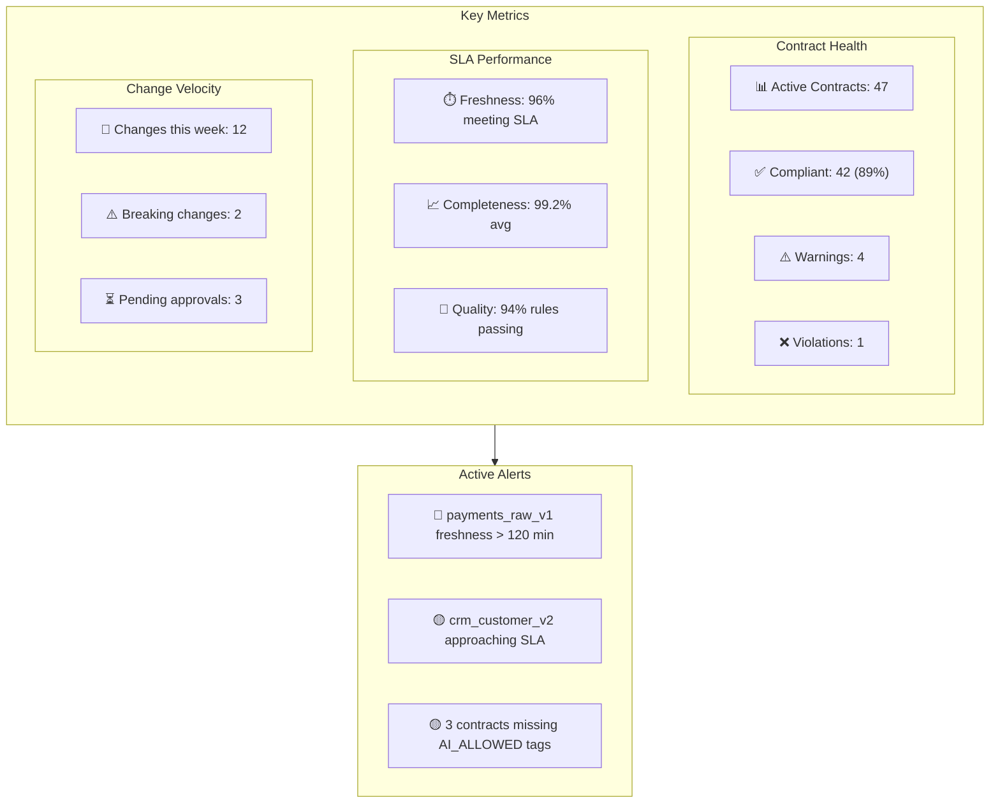

---

## Next Steps

### Phase 1: Foundation (Weeks 1-4)
1. ☐ Define organizational tag taxonomy
2. ☐ Create contract YAML schema standard
3. ☐ Build contract validation scripts
4. ☐ Set up Git repository structure

### Phase 2: Registry (Weeks 5-8)
1. ☐ Deploy contract registry tables in Snowflake
2. ☐ Build basic CRUD API for contracts
3. ☐ Implement tag application automation
4. ☐ Create consumer registration workflow

### Phase 3: CI/CD Integration (Weeks 9-12)
1. ☐ Implement GitHub Actions pipeline
2. ☐ Build breaking change detection
3. ☐ Set up consumer notification system
4. ☐ Create environment promotion workflow

### Phase 4: Observability (Weeks 13-16)
1. ☐ Deploy SLA monitoring views
2. ☐ Build quality rule execution engine
3. ☐ Create observability dashboard
4. ☐ Implement alerting integration

### Phase 5: UI/UX (Weeks 17-20)
1. ☑ Build contract management web UI → **Streamlit in Snowflake app** (`streamlit/data_contracts_app.py`)
2. ☐ Implement lineage visualization
3. ☑ Create self-service consumer portal → **Cortex Analyst chat interface**
4. ☑ Deploy to internal marketplace → **Streamlit app deployed via `12_streamlit_app.sql`**

---

## Appendix: Reference Materials

- [Snowflake Object Tagging Documentation](https://docs.snowflake.com/en/user-guide/object-tagging)
- [dbt Model Contracts](https://docs.getdbt.com/docs/collaborate/govern/model-contracts)
- [Data Contract Specification (Open Standard)](https://datacontract.com/)
- [PayPal Data Contract Template](https://github.com/paypal/data-contract-template)
